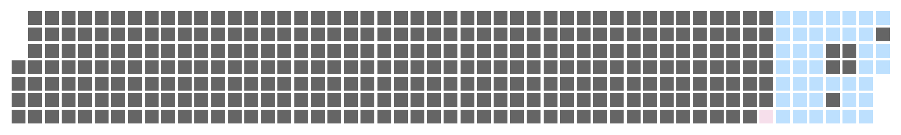
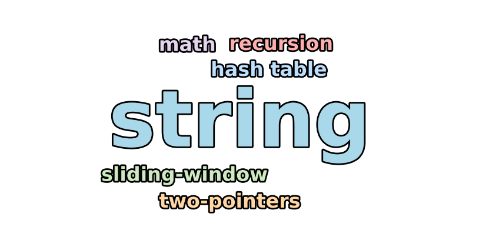
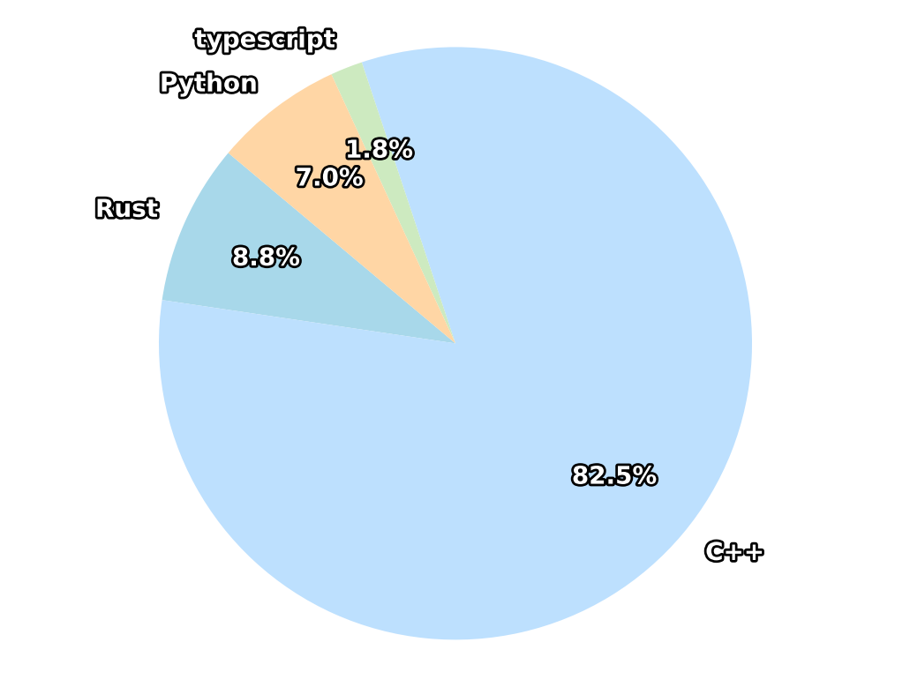

# LeetCode Daily Grind

- **Total unique problems:** 12
- **Current streak:** 5 days
- **Longest streak:** 5 days
- **Most recent attempt:** 2025-08-28

## 🎮 Level & XP
- **Level:** 1  
- **XP:** 190 / 200  
- [██████████████████████░░] 90%

## 📆 Last 12 Months — Activity Heatmap

## 📊 Languages & Topics

<table>
<tr>
<td width="50%" align="center">

### 🏷️ Tag Cloud

</td>
<td width="50%" align="center">

### 🧩 Language Split

</td>
</tr>
</table>

## 🏅 Achievements
- 🥉 **10 Problems**
- 🧠 **Multi-Lingual Solver (2+)**
- 🧩 **Tri-Lingual Solver (3+)**

## 📜 All Solved Exercises
| Date | Problem | Language | Solution |
|------|---------|----------|----------|
| 2025-08-28 | [3446 Sort Matrix By Diagonals](https://leetcode.com/problems/sort-matrix-by-diagonals/description) | C++ | [📄](cpp/3446.sort_matrix_by_diagonals.cpp) |
| 2025-08-27 | [3459 Length Of Longest V-Shaped Diagonal Segment](https://leetcode.com/problems/length-of-longest-v-shaped-diagonal-segment/) | C++ | [📄](cpp/3459.length_of_longest_v-shaped_diagonal_segment.cpp) |
| 2025-08-26 | [3000 Maximum Area Of Longest Diagonal Rectangle](https://leetcode.com/problems/maximum-area-of-longest-diagonal-rectangle/description) | C++ | [📄](cpp/3000.maximum_area_of_longest_diagonal_rectangle.cpp) |
| 2025-08-25 | [498 Diagonal Traverse](https://leetcode.com/problems/diagonal-traverse/description) | C++ | [📄](cpp/498.diagonal_traverse.cpp) |
| 2025-08-24 | [326 Power Of Three](https://leetcode.com/problems/power-of-three/description/) | Rust | [📄](rust/326.power_of_three.rs) |
| 2025-08-24 | [3195 Find The Minimum Area To Cover All Ones I](https://leetcode.com/problems/find-the-minimum-area-to-cover-all-ones-I/description) | C++ | [📄](cpp/3195.find_the_minimum_area_to_cover_all_ones_I.cpp) |
| 2025-08-24 | [2348 Number Of Zero-Filled Subarrays](https://leetcode.com/problems/number-of-zero-filled-subarrays/description) | C++ | [📄](cpp/2348.number_of_zero-filled_subarrays.cpp) |
| 2025-08-24 | [1493 Longest Subarray Of 1'S After Deleting One Element](https://leetcode.com/problems/longest-subarray-of-1s-after-deleting-one-element/description) | C++ | [📄](cpp/1493.longest_subarray_of_1's_after_deleting_one_element.cpp) |
| 2025-08-24 | [1323 Maximum 69 Number](https://leetcode.com/problems/maximum-69-number/description) | C++ | [📄](cpp/1323.maximum_69_number.cpp) |
| 2025-08-24 | [342 Power Of Four](https://leetcode.com/problems/power-of-four/description) | C++ | [📄](cpp/342.power_of_four.cpp) |
| 2025-08-24 | [202 Happy Number](https://leetcode.com/problems/happy-number/description/) | Python | [📄](py/202.happy_number.py) |
| 2025-08-24 | [2264 Largest 3-Same-Digit Number In String](https://leetcode.com/problems/largest-3-same-digit-number-in-string/description/) | Python | [📄](py/2264.largest_3-same-digit_number_in_string.py) |

> README auto-generated.
